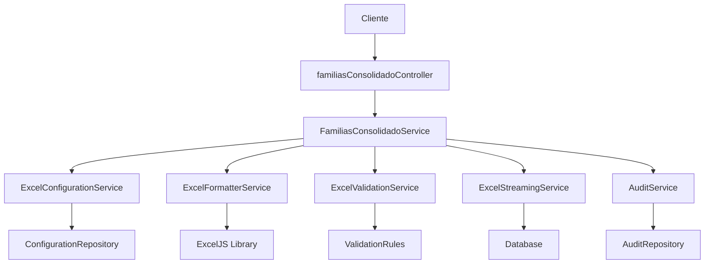

# Design Document

## Overview

Este diseño mejora significativamente el sistema de exportación Excel del servicio consolidado de familias existente. La solución mantiene compatibilidad con la API actual mientras añade capacidades avanzadas de configuración, optimización de rendimiento y formato profesional.

**Arquitectura de la Mejora:**
- Extiende el `FamiliasConsolidadoService` existente con nuevas capacidades
- Añade un nuevo `ExcelConfigurationService` para manejo de configuraciones
- Implementa `ExcelFormatterService` para formato profesional
- Crea `ExcelValidationService` para validación robusta de datos
- Mantiene compatibilidad total con endpoints existentes `/api/familias/excel`

## Architecture

### Componentes Principales



### Flujo de Datos Mejorado

1. **Configuración**: Cliente envía parámetros + configuración opcional
2. **Validación**: Sistema valida filtros y configuración
3. **Consulta Optimizada**: Obtiene datos usando queries optimizadas con streaming
4. **Procesamiento**: Valida, transforma y formatea datos
5. **Generación**: Crea Excel con formato profesional
6. **Auditoría**: Registra la operación
7. **Respuesta**: Devuelve archivo Excel optimizado

## Components and Interfaces

### 1. ExcelConfigurationService

```javascript
class ExcelConfigurationService {
  // Configuraciones predefinidas
  static CONFIGURATIONS = {
    BASIC: 'basic_family_info',
    COMPLETE: 'complete_family_data', 
    STATISTICAL: 'statistical_report',
    HEALTH_FOCUSED: 'health_and_medical',
    GEOGRAPHIC: 'geographic_distribution'
  };

  // Métodos principales
  async getConfiguration(configId, customConfig = {})
  async saveConfiguration(userId, configName, config)
  async validateConfiguration(config)
  generateColumnMapping(config)
  getDefaultConfiguration()
}
```

**Configuración de Ejemplo:**
```javascript
{
  name: "Reporte Completo Familias",
  columns: {
    family_basic: true,
    geographic_info: true,
    parents_details: true,
    children_info: true,
    deceased_members: false,
    health_conditions: true,
    skills_abilities: false
  },
  format: {
    multiple_sheets: true,
    include_charts: true,
    professional_styling: true,
    auto_filters: true
  },
  grouping: {
    group_by: "municipio", // municipio, sector, none
    sort_by: "apellido_familiar",
    include_subtotals: true
  }
}
```

### 2. ExcelFormatterService

```javascript
class ExcelFormatterService {
  async createProfessionalWorkbook(data, config)
  async formatFamilyDataSheet(worksheet, families, config)
  async createStatisticsSheet(workbook, statistics)
  async createSummarySheet(workbook, metadata)
  async applyProfessionalStyling(worksheet)
  async addChartsAndGraphics(workbook, data)
  async createNavigationIndex(workbook)
}
```

**Características de Formato:**
- Estilos profesionales con paleta de colores corporativa
- Filtros automáticos en todas las columnas
- Formato condicional para destacar datos importantes
- Gráficos automáticos para estadísticas
- Índice navegable para múltiples hojas
- Ajuste automático de columnas

### 3. ExcelValidationService

```javascript
class ExcelValidationService {
  async validateFamilyData(families)
  async checkDataIntegrity(data)
  async identifyDuplicates(families)
  async validateGeographicData(families)
  async generateValidationReport(issues)
  async autoCorrectCommonIssues(data)
}
```

**Validaciones Implementadas:**
- Campos obligatorios faltantes
- Formatos de fecha y números
- Consistencia de datos geográficos
- Duplicados por identificación
- Integridad referencial familia-personas
- Validación de rangos de edad

### 4. ExcelStreamingService

```javascript
class ExcelStreamingService {
  async processLargeDataset(query, config, progressCallback)
  async streamFamiliesToExcel(workbook, query, batchSize = 500)
  async createMultipleSheets(workbook, data, maxRowsPerSheet = 50000)
  async optimizeMemoryUsage(workbook)
  calculateProcessingBatches(totalRecords, memoryLimit)
}
```

### 5. Extensión del FamiliasConsolidadoService

```javascript
// Nuevos métodos añadidos al servicio existente
class FamiliasConsolidadoService {
  // Métodos existentes se mantienen...
  
  // Nuevos métodos para Excel mejorado
  async generarReporteExcelAvanzado(filtros, configuracion)
  async obtenerDatosCompletosParaExcel(filtros)
  async aplicarValidacionesAvanzadas(datos)
  async generarEstadisticasDetalladas(datos, configuracion)
  async crearReporteMultiHoja(datos, configuracion)
}
```

## Data Models

### Estructura de Datos Expandida para Excel

```javascript
// Estructura completa de familia para Excel
const FamiliaCompleta = {
  // Información básica de familia
  familia: {
    id_familia: Number,
    apellido_familiar: String,
    direccion_familia: String,
    telefono: String,
    email: String,
    sector: String,
    tamaño_familia: Number,
    tipo_vivienda: String,
    codigo_familia: String,
    comunionEnCasa: Boolean,
    numero_contrato_epm: String
  },
  
  // Información geográfica
  ubicacion: {
    parroquia: String,
    municipio: String,
    vereda: String,
    sector_nombre: String
  },
  
  // Miembros de la familia organizados por rol
  miembros: {
    padre: {
      nombre_completo: String,
      identificacion: String,
      telefono: String,
      fecha_nacimiento: Date,
      edad: Number,
      ocupacion: String,
      estado_civil: String,
      enfermedades: Array,
      destrezas: Array
    },
    madre: {
      // Misma estructura que padre
    },
    hijos: [{
      nombre_completo: String,
      identificacion: String,
      fecha_nacimiento: Date,
      edad: Number,
      sexo: String,
      estudios: String,
      enfermedades: Array,
      destrezas: Array
    }],
    otros_familiares: [/* estructura similar */]
  },
  
  // Información de difuntos (si aplica)
  difuntos: [{
    nombre_completo: String,
    fecha_fallecimiento: Date,
    parentesco_inferido: String
  }],
  
  // Estadísticas de la familia
  estadisticas: {
    total_miembros: Number,
    promedio_edad: Number,
    tiene_enfermedades: Boolean,
    total_destrezas: Number,
    estado_encuesta: String
  }
};
```

### Configuración de Columnas Dinámicas

```javascript
const ColumnasDisponibles = {
  // Información básica
  'familia.apellido_familiar': 'Apellido Familiar',
  'familia.telefono': 'Teléfono Familia',
  'familia.direccion_familia': 'Dirección',
  'familia.tipo_vivienda': 'Tipo Vivienda',
  
  // Ubicación
  'ubicacion.parroquia': 'Parroquia',
  'ubicacion.municipio': 'Municipio',
  'ubicacion.vereda': 'Vereda',
  'ubicacion.sector': 'Sector',
  
  // Padre
  'miembros.padre.nombre_completo': 'Nombre Padre',
  'miembros.padre.identificacion': 'Documento Padre',
  'miembros.padre.telefono': 'Teléfono Padre',
  'miembros.padre.edad': 'Edad Padre',
  'miembros.padre.ocupacion': 'Ocupación Padre',
  
  // Madre
  'miembros.madre.nombre_completo': 'Nombre Madre',
  'miembros.madre.identificacion': 'Documento Madre',
  // ... más campos de madre
  
  // Estadísticas
  'estadisticas.total_miembros': 'Total Miembros',
  'estadisticas.promedio_edad': 'Promedio Edad',
  'estadisticas.tiene_enfermedades': 'Tiene Enfermedades'
};
```

## Error Handling

### Estrategia de Manejo de Errores

1. **Errores de Configuración**
   - Validación de configuración antes del procesamiento
   - Fallback a configuración por defecto
   - Mensajes descriptivos de errores de configuración

2. **Errores de Datos**
   - Continuación del procesamiento con datos válidos
   - Reporte de errores en hoja separada
   - Auto-corrección de errores menores

3. **Errores de Memoria/Rendimiento**
   - Procesamiento por lotes automático
   - Reducción automática de batch size
   - Paginación en múltiples hojas

4. **Errores de Formato Excel**
   - Validación de límites de Excel (1M filas, 16K columnas)
   - Truncamiento inteligente de datos
   - Formato alternativo si Excel falla

```javascript
class ExcelErrorHandler {
  static handleConfigurationError(error, defaultConfig) {
    // Retorna configuración por defecto con warning
  }
  
  static handleDataValidationError(errors, data) {
    // Crea hoja de errores y continúa con datos válidos
  }
  
  static handleMemoryError(error, currentBatch) {
    // Reduce batch size y reintenta
  }
  
  static handleExcelLimitsError(data, config) {
    // Implementa paginación automática
  }
}
```

## Testing Strategy

### Niveles de Testing

1. **Unit Tests**
   - Cada servicio nuevo (Configuration, Formatter, Validation, Streaming)
   - Métodos de transformación de datos
   - Validaciones individuales
   - Formateo de celdas y estilos

2. **Integration Tests**
   - Flujo completo de generación Excel
   - Integración con servicio existente
   - Persistencia de configuraciones
   - Auditoría de operaciones

3. **Performance Tests**
   - Generación con 1K, 5K, 10K familias
   - Uso de memoria durante procesamiento
   - Tiempo de respuesta por tamaño de dataset
   - Streaming de datos grandes

4. **End-to-End Tests**
   - Casos de uso completos desde API
   - Validación de archivos Excel generados
   - Verificación de formato y contenido
   - Compatibilidad con diferentes versiones Excel

### Datos de Prueba

```javascript
// Configuraciones de test
const TestConfigurations = {
  minimal: { /* configuración mínima */ },
  complete: { /* configuración completa */ },
  large_dataset: { /* para pruebas de rendimiento */ },
  edge_cases: { /* casos límite */ }
};

// Datasets de prueba
const TestDatasets = {
  small: 10, // familias
  medium: 100,
  large: 1000,
  xlarge: 5000
};
```

## Security Considerations

### Protección de Datos Sensibles

1. **Control de Acceso**
   - Validación de permisos específicos para exportación
   - Límites por rol de usuario
   - Auditoría de accesos

2. **Anonimización Opcional**
   - Opción de exportar datos anonimizados
   - Enmascaramiento de datos sensibles
   - Configuración por tipo de usuario

3. **Auditoría Completa**
   - Log de todas las exportaciones
   - Tracking de configuraciones utilizadas
   - Alertas para exportaciones masivas

```javascript
class ExcelSecurityService {
  async validateExportPermissions(userId, dataScope)
  async applyDataMasking(data, userRole)
  async auditExportOperation(userId, config, recordCount)
  async checkExportLimits(userId, requestedRecords)
}
```

## Performance Optimizations

### Estrategias de Optimización

1. **Query Optimization**
   - Índices específicos para consultas Excel
   - Queries optimizadas con JOINs eficientes
   - Paginación a nivel de base de datos

2. **Memory Management**
   - Streaming de datos grandes
   - Liberación de memoria por lotes
   - Configuración dinámica de batch size

3. **Caching Strategy**
   - Cache de configuraciones frecuentes
   - Cache de datos geográficos
   - Cache de validaciones comunes

4. **Parallel Processing**
   - Procesamiento paralelo de validaciones
   - Generación concurrente de hojas
   - Formateo asíncrono de celdas

```javascript
// Configuración de rendimiento
const PerformanceConfig = {
  batchSize: {
    small: 100,    // < 1K registros
    medium: 500,   // 1K - 5K registros  
    large: 1000    // > 5K registros
  },
  memoryLimits: {
    maxRowsInMemory: 10000,
    maxSheetsSimultaneous: 3
  },
  caching: {
    configurationTTL: 3600, // 1 hora
    geographicDataTTL: 86400 // 24 horas
  }
};
```