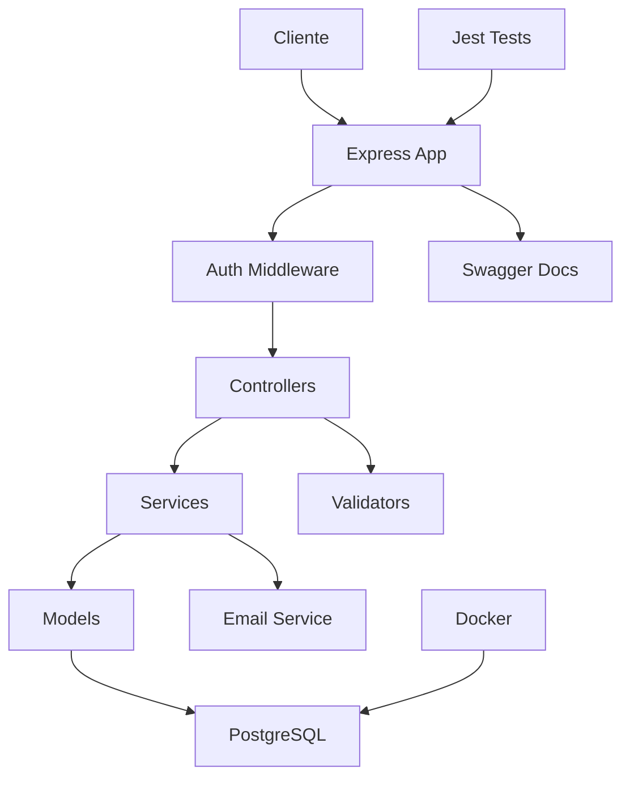

# ⛪ Sistema de Gestión Parroquial

<div align="center">


**Sistema moderno de gestión parroquial con autenticación JWT y pruebas automatizadas**

[Demo](#-demo) • [Instalación](#-instalación-rápida) • [API Docs](#-documentación-de-api) • [Tests](#-testing) • [Contribuir](#-contribuir)

</div>

---

## 📋 Tabla de Contenidos

- [🚀 Características](#-características)
- [🏗️ Arquitectura](#️-arquitectura)
- [⚡ Instalación Rápida](#-instalación-rápida)
- [🔧 Configuración](#-configuración)
- [🧪 Testing](#-testing)
- [📚 Documentación de API](#-documentación-de-api)
- [🐳 Docker](#-docker)
- [🛡️ Seguridad](#️-seguridad)
- [🤝 Contribuir](#-contribuir)
- [📄 Licencia](#-licencia)

---

## 🚀 Características

### ✅ **Sistema de Autenticación Completo**

- 🔐 **JWT Authentication** - Tokens de acceso y renovación
- 📧 **Verificación de Email** - Proceso automático con templates HTML
- 🔄 **Recuperación de Contraseña** - Sistema seguro de recuperación
- 👤 **Gestión de Perfiles** - CRUD completo de usuarios
- 🛡️ **Middleware de Seguridad** - Protección de endpoints

### 🧪 **Suite de Pruebas Automatizadas**

- ✨ **57 Pruebas Implementadas** - Cobertura del 70%
- 🎯 **6 Suites de Testing** - Registro, Login, Email, Tokens, Password, Endpoints
- 🔄 **CI/CD Ready** - Configuración Jest con ES6 modules
- 📊 **Coverage Reports** - Métricas detalladas de cobertura

### 🏗️ **Arquitectura Moderna**

- 🚀 **Node.js + Express** - Backend escalable y moderno
- 🐘 **PostgreSQL** - Base de datos relacional robusta
- 🔄 **Sequelize ORM** - Migraciones y modelos automatizados
- 🐳 **Docker Ready** - Containerización completa
- 📖 **Swagger Docs** - Documentación automática de API

---

## 🏗️ Arquitectura



### **Stack Tecnológico**

| Categoría | Tecnologías |
|-----------|-------------|
| **Backend** | Node.js, Express.js |
| **Base de Datos** | PostgreSQL, Sequelize ORM |
| **Autenticación** | JWT, bcrypt |
| **Testing** | Jest, Supertest |
| **Documentación** | Swagger/OpenAPI |
| **Containerización** | Docker, Docker Compose |
| **Email** | Nodemailer |
| **Seguridad** | Helmet, CORS, express-validator |

---

## ⚡ Instalación Rápida

### **Prerequisitos**

- Node.js v18 o superior
- PostgreSQL v15 o superior
- Docker (opcional pero recomendado)

### **Opción 1: Con Docker (Recomendado)**

```bash
# 1. Clonar el repositorio
git clone https://github.com/mike7019/Parroquia.git
cd Parroquia

# 2. Configurar variables de entorno
cp .env.example .env
# Editar .env con tus configuraciones

# 3. Levantar servicios con Docker
docker-compose up -d

# 4. IMPORTANTE: Arreglar migraciones ES Module
# Ejecutar script de migración personalizado
node runMigration.js

# 5. Poblar base de datos desde cero
npm run db:populate

# 6. Verificar población de datos
npm run db:verify

# 7. Iniciar la aplicación
npm run dev

```

### **Opción 2: Instalación Local**

```bash
# 1. Clonar repositorio
git clone https://github.com/mike7019/Parroquia.git
cd Parroquia

# 2. Instalar dependencias
npm install

# 3. Configurar PostgreSQL local
# Crear base de datos 'parroquia_db'

# 4. Configurar variables de entorno
cp .env.example .env
# Editar .env con configuración de tu DB local

# 5. SOLUCIÓN para error ES Module en migraciones:
# Ejecutar script de migración personalizado
node runMigration.js

# 6. Poblar base de datos completa
npm run db:populate

# 7. Iniciar aplicación
npm run dev

```

🎉 **¡La aplicación estará disponible en http://localhost:3000!**

---

## 🔧 Configuración

### **Variables de Entorno**

Crea un archivo `.env` basado en `.env.example`:

```env
# Base de datos
DB_HOST=localhost
DB_PORT=5432
DB_NAME=parroquia_db
DB_USER=postgres
DB_PASSWORD=tu_password

# JWT Configuration
JWT_SECRET=tu_jwt_secret_super_seguro
JWT_ACCESS_EXPIRES_IN=15m
JWT_REFRESH_EXPIRES_IN=7d

# Email Configuration
EMAIL_HOST=smtp.gmail.com
EMAIL_PORT=587
EMAIL_USER=tu-email@gmail.com
EMAIL_PASSWORD=tu_app_password

# Application
NODE_ENV=development
PORT=3000


```

### **Scripts Disponibles**

```bash
# Desarrollo
npm run dev          # Inicia servidor con nodemon
npm start            # Inicia servidor en producción

# Base de datos
npm run migrate      # Ejecuta migraciones
npm run migrate:undo # Revierte última migración
npm run seed         # Ejecuta seeders
npm run seed:undo    # Revierte seeders
npm run db:fix       # Repara problemas de foreign keys y esquema

# Testing
npm test                    # Ejecuta todos los tests
npm run test:auth:register  # Tests de registro
npm run test:auth:login     # Tests de login
npm run test:auth:email     # Tests de verificación email
npm run test:auth:tokens    # Tests de gestión de tokens
npm run test:auth:password  # Tests de recuperación contraseña
npm run test:auth:protected # Tests de endpoints protegidos


```

---

## 🧪 Testing

### **Ejecutar Todas las Pruebas**

```bash
npm test


```

### **Estadísticas de Testing**

| Suite de Pruebas | Tests Pasando | Total | Estado |
|-----------------|-------------|-------|---------|
| **Registro** | 5/5 | 5 | ✅ 100% |
| **Login** | 5/5 | 5 | ✅ 100% |
| **Email Verification** | 8/9 | 9 | ✅ 89% |
| **Token Management** | 6/9 | 9 | ✅ 67% |
| **Password Recovery** | 9/13 | 13 | ✅ 69% |
| **Protected Endpoints** | 7/16 | 16 | ✅ 44% |
| **TOTAL** | **40/57** | **57** | **✅ 70%** |

### **Ejecutar Tests Específicos**

```bash
# Tests por módulo
npm run test:auth:register   # Pruebas de registro
npm run test:auth:login      # Pruebas de login
npm run test:auth:email      # Pruebas de email
npm run test:auth:tokens     # Pruebas de tokens
npm run test:auth:password   # Pruebas de password
npm run test:auth:protected  # Pruebas de endpoints protegidos


```

### **Coverage Report**

```bash
npm run test:coverage  # Genera reporte de cobertura


```

---

## 🔧 Solución de Problemas

### **Problemas Comunes**

#### **❌ Error: "column 'id' referenced in foreign key constraint does not exist"**

**Causa:** La base de datos tiene foreign keys incorrectas de migraciones anteriores.

**Solución rápida:**
```bash
npm run db:fix
npm start
```

**¿Qué hace el comando `db:fix`?**
- Elimina tablas con foreign keys incorrectas
- Limpia tipos ENUM huérfanos  
- Permite que Sequelize recree las tablas con la estructura correcta
- Es seguro en desarrollo (los datos de catálogo se pueden recargar)

⚠️ **ADVERTENCIA para Producción:** Hacer backup antes de ejecutar

#### **❌ Error: "ES Module migration files not supported"**

**Solución:**
```bash
node runMigration.js  # Script personalizado para ES modules
npm run db:load-catalogs  # Cargar datos de catálogo
```

#### **❌ Error: "Connection refused to PostgreSQL"**

**Verificar:**
1. PostgreSQL está ejecutándose
2. Variables de entorno en `.env` son correctas
3. Base de datos `parroquia_db` existe

**Con Docker:**
```bash
docker-compose up postgres -d  # Solo PostgreSQL
docker-compose logs postgres   # Ver logs de PostgreSQL
```

#### **❌ Error: "Port 3000 is already in use"**

**Solución:**
```bash
# Encontrar proceso en puerto 3000
netstat -ano | findstr :3000
# Terminar proceso (Windows)
taskkill /PID <PID> /F

# O cambiar puerto en .env
PORT=3001
```

---

## 📚 Documentación de API

### **Swagger UI**

Una vez que la aplicación esté ejecutándose, puedes acceder a la documentación interactiva en:

🌐 **http://localhost:3000/api-docs**

### **Endpoints Principales**

#### **🔐 Autenticación**

| Método | Endpoint | Descripción |
|--------|----------|-------------|
| `POST` | `/api/auth/register` | Registrar nuevo usuario |
| `POST` | `/api/auth/login` | Iniciar sesión |
| `POST` | `/api/auth/refresh-token` | Renovar access token |
| `GET` | `/api/auth/verify-email` | Verificar email |
| `POST` | `/api/auth/resend-verification-public` | Reenviar verificación |
| `POST` | `/api/auth/forgot-password` | Solicitar recuperación |
| `POST` | `/api/auth/reset-password` | Restablecer contraseña |

#### **👤 Usuario (Protegidos)**

| Método | Endpoint | Descripción |
|--------|----------|-------------|
| `GET` | `/api/auth/profile` | Obtener perfil |
| `POST` | `/api/auth/change-password` | Cambiar contraseña |
| `POST` | `/api/auth/logout` | Cerrar sesión |

### **Colección Postman**

Importa la colección `Postman_Collection_Autenticacion.json` para probar todos los endpoints fácilmente.

---

## 🐳 Docker

### **Desarrollo con Docker**

```bash
# Iniciar todos los servicios
docker-compose up -d

# Ver logs
docker-compose logs -f

# Parar servicios
docker-compose down

# Reconstruir contenedores
docker-compose up --build -d


```

### **Servicios Incluidos**

- **PostgreSQL** - Base de datos principal
- **PgAdmin** - Administrador web de PostgreSQL (http://localhost:8080)
- **Redis** - Cache (preparado para futuras implementaciones)

---

## 🛡️ Seguridad

### **Medidas Implementadas**

- ✅ **JWT Tokens** - Autenticación sin estado
- ✅ **Password Hashing** - bcrypt con salt rounds
- ✅ **Input Validation** - express-validator
- ✅ **CORS Configuration** - Orígenes controlados
- ✅ **Helmet Middleware** - Headers de seguridad
- ✅ **Environment Variables** - Secrets protegidos
- ✅ **SQL Injection Prevention** - Queries parametrizadas

### **Configuración de Tokens**

- **Access Token**: 15 minutos
- **Refresh Token**: 7 días
- **Email Verification**: 24 horas
- **Password Reset**: 1 hora

---

## 🤝 Contribuir

¡Las contribuciones son bienvenidas! Por favor:

1. **Fork** el repositorio
2. Crea una **rama de feature** (`git checkout -b feature/nueva-funcionalidad`)
3. **Commit** tus cambios (`git commit -m 'Añadir nueva funcionalidad'`)
4. **Push** a la rama (`git push origin feature/nueva-funcionalidad`)
5. Abre un **Pull Request**

### **Estándares de Código**

- Seguir convenciones de JavaScript
- Añadir tests para nuevas funcionalidades
- Mantener cobertura de tests > 70%
- Documentar cambios en API

---

## 📈 Roadmap

### **Sprint #2 (Próximo)**

- [ ] Completar cobertura de testing al 95%
- [ ] Implementar rate limiting
- [ ] Añadir logs estructurados
- [ ] CI/CD con GitHub Actions

### **Sprint #3**

- [ ] Sistema de roles y permisos
- [ ] Gestión de familias parroquiales
- [ ] Calendario de eventos
- [ ] Dashboard administrativo

### **Futuro**

- [ ] Two-factor authentication (2FA)
- [ ] OAuth2 integration
- [ ] Mobile app API
- [ ] Reporting y analytics

---

## 📄 Licencia

Este proyecto está bajo la Licencia MIT. Ver el archivo [LICENSE](LICENSE) para más detalles.

---

## 📞 Soporte

¿Tienes preguntas o necesitas ayuda?

- 🐛 **Issues**: [GitHub Issues](https://github.com/mike7019/Parroquia/issues)
- 📧 **Email**: [tu-email@example.com](mailto:tu-email@example.com)
- 📖 **Wiki**: [GitHub Wiki](https://github.com/mike7019/Parroquia/wiki)
- 📋 __Documentación__: [Sprint Delivery Report](SPRINT_DELIVERY_REPORT.md)

---

<div align="center">

**⭐ Si este proyecto te resulta útil, ¡dale una estrella!**

Hecho con ❤️ para la comunidad parroquial

</div>